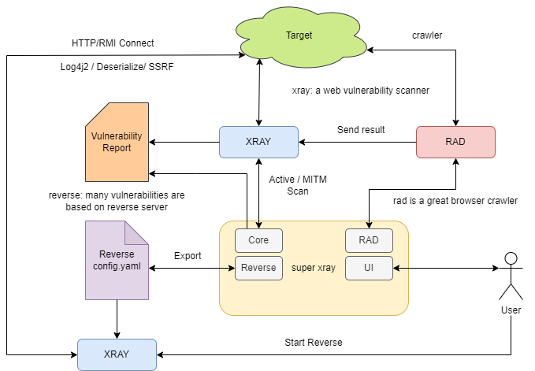
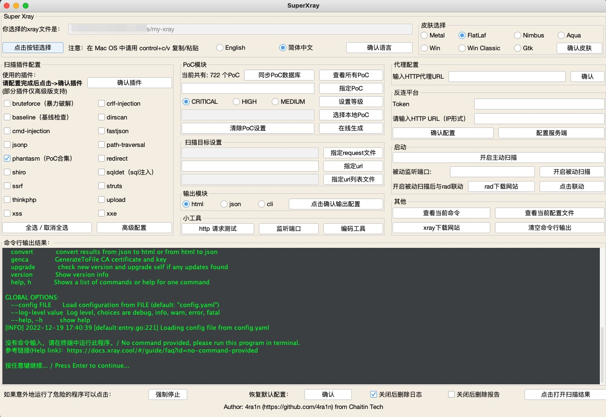
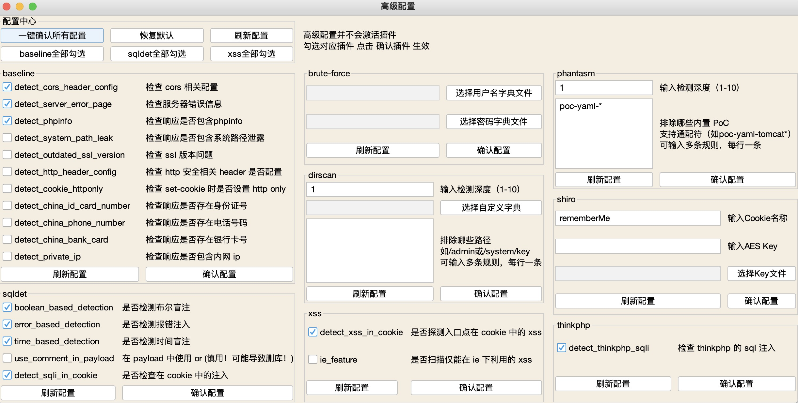
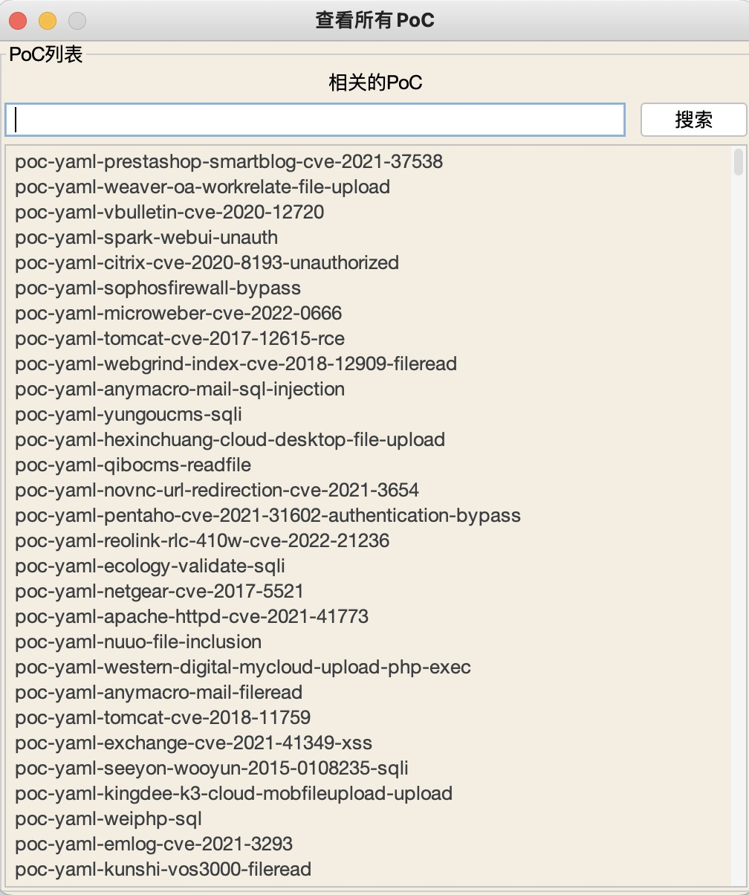
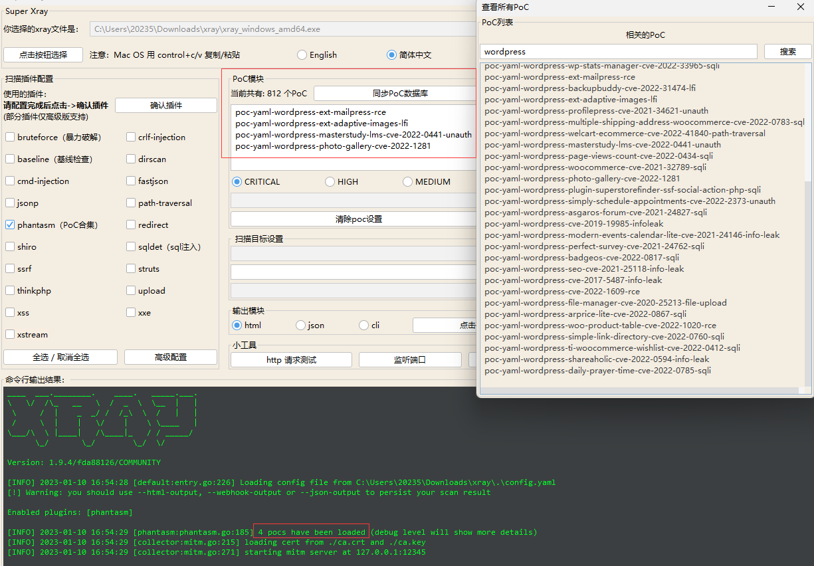
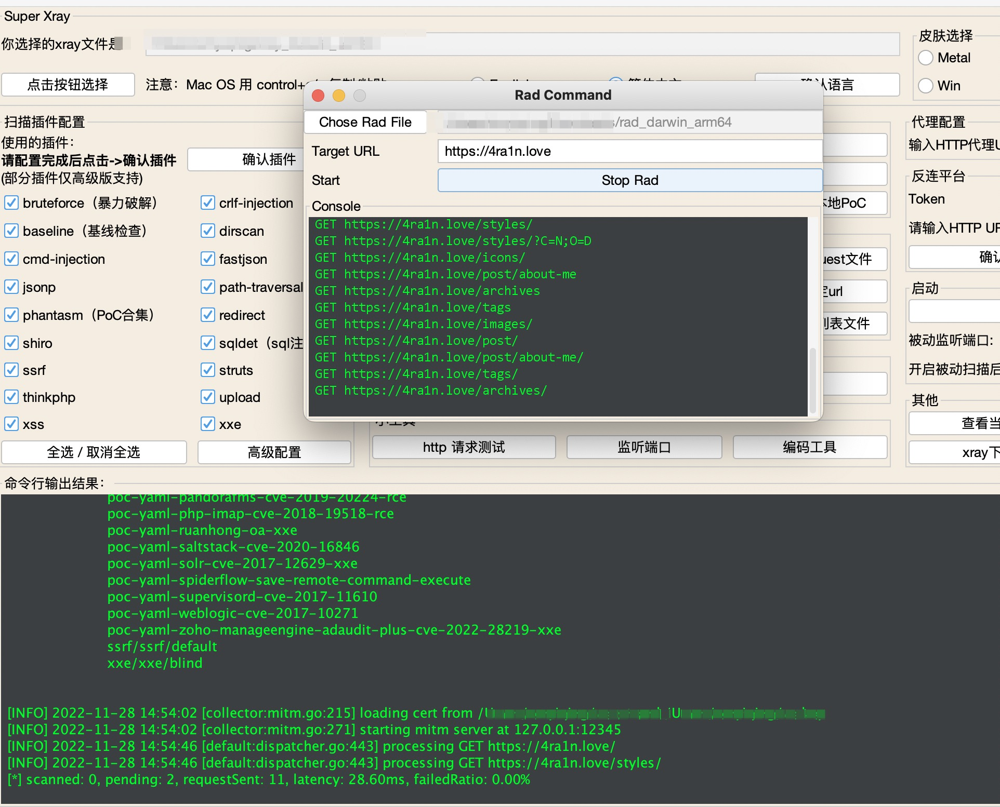
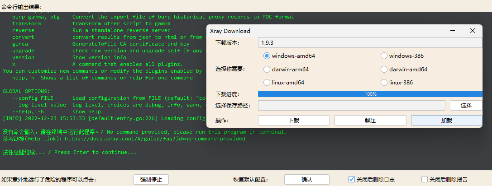
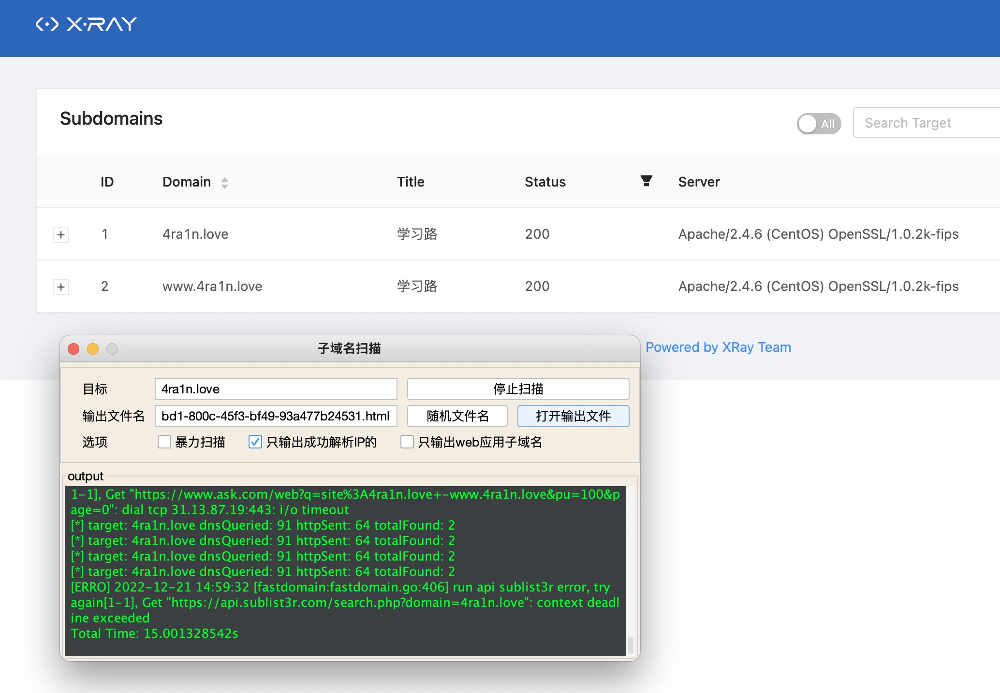

# Super Xray

[English Version](doc/README.md)

## 介绍

[xray](https://github.com/chaitin/xray) 是一款优秀的漏洞扫描工具，但目前只有命令行版本，通过 `config.yaml` 配置文件启动，很多情况下不好上手，需要一款 GUI 工具来帮助新人更快使用。本工具仅是简单的命令行包装，并不是直接调用方法。在 xray 的规划中，未来会有一款真正的完善的 GUI 版 XrayPro 工具，敬请期待。

使用前提：
- 本地有 `JRE/JDK 8+` 环境（如果使用内置`JRE`的`exe`版本无需`Java`环境）
- 使用 `java -jar SuperXray.jar` 启动（在`Windows`中双击启动会有权限问题）
- 前往 [ctstack](https://stack.chaitin.com/tool/detail?id=1) 或 [xray 下载站](https://download.xray.cool) 下载最新版 `xray`

注意：
- 请使用 1080P 及以上分辨率，在 720P 及以下分辨率可能无法完全显示
- 请使用最新版`xray`（本工具未兼容老版本`xray`）
- 支持两种方式的`exe`文件，`system`版使用系统的`JRE`，另一种内置了`JRE 8`

整体架构：

支持中文和英文：

可以方便地搜索poc并运行：

## 下载

最新版下载地址：[Latest Release](https://github.com/4ra1n/super-xray/releases/latest)

## 指定多个PoC

搜索后复制到输入框，注意换行分割

## 与rad联动

在0.8版本以后可以与`rad`联动：

注意：先输入端口开启被动扫描，再打开`rad`配合

## 下载面板

在1.0版本以后新增下载面板：

## 子域名扫描

在1.0版本以后支持子域名扫描：

## 反连平台

1. 配置好客户端的反连平台后点击`配置服务端`
2. 任意输入数据库文件名
3. 任意输入token密码
4. 不要改ip并输入一个监听端口
5. 点击导出配置文件得到一个`reverse/config.yaml`
6. 把`xray`和这个文件复制一份到服务端
7. 服务端`./xray reverse`启动反连平台
8. 在反连平台输入对应到`token`和`http url`即可（注意是ip格式例如http://1.1.1.1:8080）
9. 开启主动扫描或被动扫描即可
