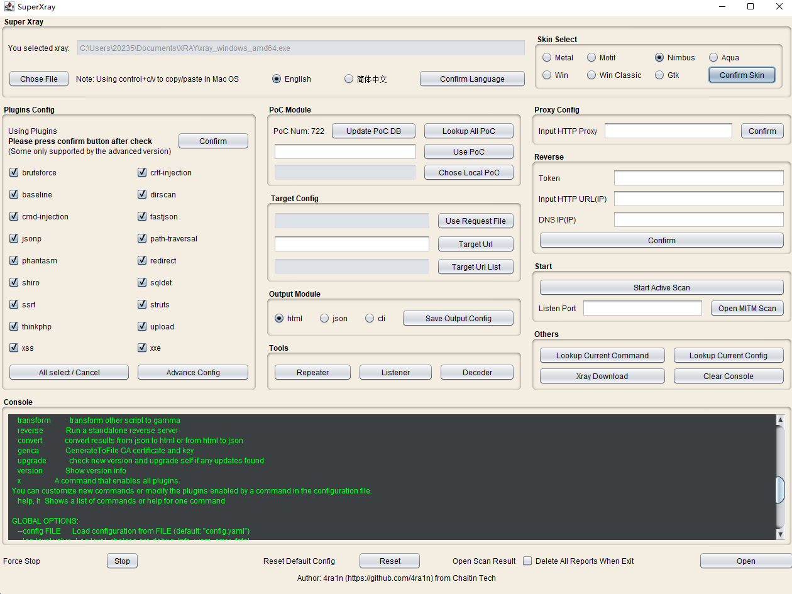

# Super Xray

[English Version](doc/README.md)

## 介绍

[xray](https://github.com/chaitin/xray) 是一款优秀的漏洞扫描工具，但目前只有命令行版本，通过 `config.yaml` 配置文件启动，很多情况下不好上手，需要一款 GUI 工具来帮助新人更快使用。本工具仅是简单的命令行包装，并不是直接调用方法。在 xray 的规划中，未来会有一款真正的完善的 GUI 版 XrayPro 工具，敬请期待。

本工具在 `JRE 19 ` 和 `JRE 11` 环境中测试通过，在 `Windows 11` 和 `Ubuntu 22.04` 以及 `Mac OS 12` 中测试通过。

注意：
- 必须在 `JRE/JDK 9` 以上环境中运行
- 请使用1080P及以上分辨率，在720P及以下分辨率可能无法完全显示

使用前提：

- 本地有 `JRE 9+` 环境
- **务必**使用 `java -jar SuperXray.jar` 启动（在`Windows`中双击启动会有权限问题）
- 前往 [ctstack](https://stack.chaitin.com/tool/detail?id=1) 下载正版 `xray`
- 注意：请使用最新版`xray`（本工具未兼容老版本`xray`）

在0.5-beta版本以后支持英文版：

## 快速上手

最新版下载地址：[Latest Release](https://github.com/4ra1n/super-xray/releases/latest)

观看B站视频：https://www.bilibili.com/video/BV1Ud4y147Er

启动： `java -jar SuperXray.jar`

加载 `xray` 二进制文件：

注意：在 `Mac OS` 中有安全限制，请先设置 **系统偏好设置** -> **安全性与隐私** -> **通用** -> **仍要打开**

看到命令行输出结果显示如下说明成功加载

默认情况下是开启所有扫描插件的，手动勾选后请选择 确认插件后新配置生效

点击 `开启主动扫描` 的前提：

- 配置好插件或者指定了某个PoC
- 必须有扫描目标设置（例如图中的url，输入完后请点击`指定url`确认）
- 建议配置好输出模块，一般情况下建议使用 `html` 方式

扫描结束后查看结果：点击右下角按钮即可（如果有结果才会打开）

其他：

- 点击下方`点击恢复按钮`可以恢复默认配置
- 点击下方强制停止在立刻停下当前的任务
- 反连平台是重要功能，但需要更多的配置，请前往官网查看文档

## PoC 模块

`PoC` 模块主要用于查询已支持的 `PoC` 有哪些，加载 `xray` 二进制文件完成后，建议先点击`同步PoC数据库`以更新最新的列表。点击`查看所有Poc`按钮后打开搜索界面。查询到希望的 `PoC` 后可以填入下方表单中，点击`指定PoC`确认设置。

查看与搜索

例如搜索 `spring`

## 高级配置

部分插件可以进行高级配置：

- 完成每一项高级配置后请点击 `确认配置` 后生效
- 只有在主界面开启了对应的插件，高级配置才会生效
- 部分插件仅高级版 `xray` 支持
- 字典配置的逻辑都是：与内置字典**合并**

## 小工具

`http` 请求测试类似 `burp` 的 `repeater` 功能

端口监听工具类似 `nc` 的监听

编码工具类似 `burp` 的 `decoder` 模块

## 皮肤

加入了一些皮肤选择：
- Java 原生的`Metal`，`Motif`和`Nimbus`
- Windows 独有的现代和经典两款皮肤
- Mac OS 独有的`Auqa`
- Gnome 独有`Gtk`

## Security

本项目存在的安全漏洞：https://github.com/4ra1n/super-xray/security/advisories

## 免责声明

本项目禁止进行未授权商业用途

本项目禁止二次开发后进行商业用途

本项目仅面向合法授权的企业安全建设行为，在使用本项目进行检测时，您应确保该行为符合当地的法律法规，并且已经取得了足够的授权

如您在使用本项目的过程中存在任何非法行为，您需自行承担相应后果，我们将不承担任何法律及连带责任

在使用本项目前，请您务必审慎阅读、充分理解各条款内容，限制、免责条款或者其他涉及您重大权益的条款可能会以加粗、加下划线等形式提示您重点注意

除非您已充分阅读、完全理解并接受本协议所有条款，否则，请您不要使用本项目

您的使用行为或者您以其他任何明示或者默示方式表示接受本协议的，即视为您已阅读并同意本协议的约束
