# Super Xray

## Introduce

[xray](https://github.com/chaitin/xray) is an excellent web vulnerability scanning tool, But only the command line version, Start via `config.yaml` file. In many cases, it is difficult to get started, and a GUI tool is needed to help newcomers use it faster. This tool is just a simple command line wrapper, not a direct method call. In the planning of xray, there will be a truly perfect GUI version of XrayPro tool in the future. Please look forward to it.

Please Note:
- The screenshot in this doc is Chinese, but there is a button to select English UI
- Must be running above JDK8
- Please use a resolution of 1080P or above, and it may not be fully displayed at a resolution of 720P or below

Other Note:

- There is JRE 8+ environment locally
- **Must**use `java -jar SuperXray.jar` start（Double click startup will cause permission problems in `Windows`）
- Please use the latest version of xray (this tool is not compatible with the old version of xray)

**After 0.7 version we support `exe` version**

After 0.6-beta version we support English Version：

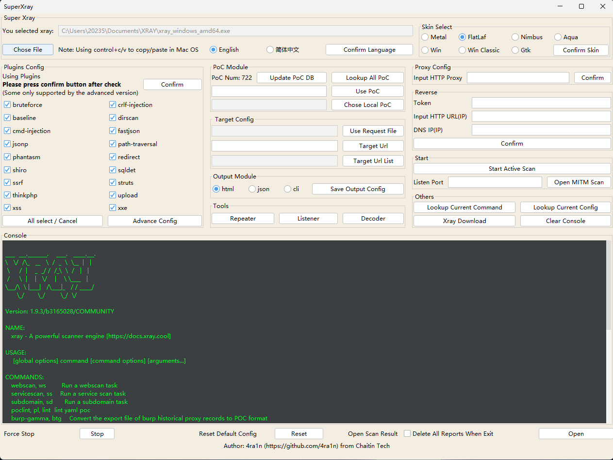

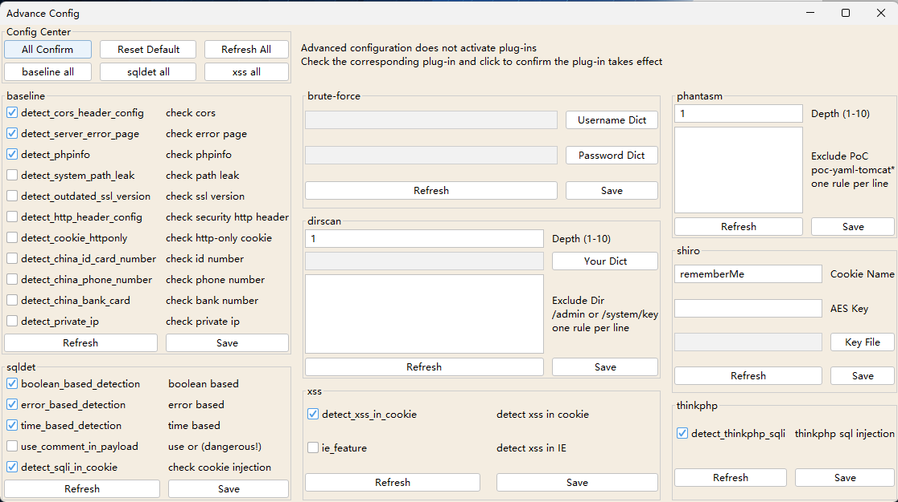

After 0.8 version we support run with `rad`:

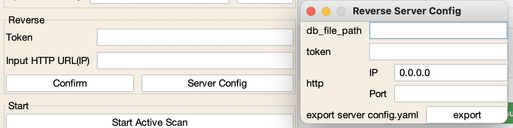

## Quick Start

Latest Download：[Latest Release](https://github.com/4ra1n/super-xray/releases/latest)

Start： `java -jar SuperXray.jar`

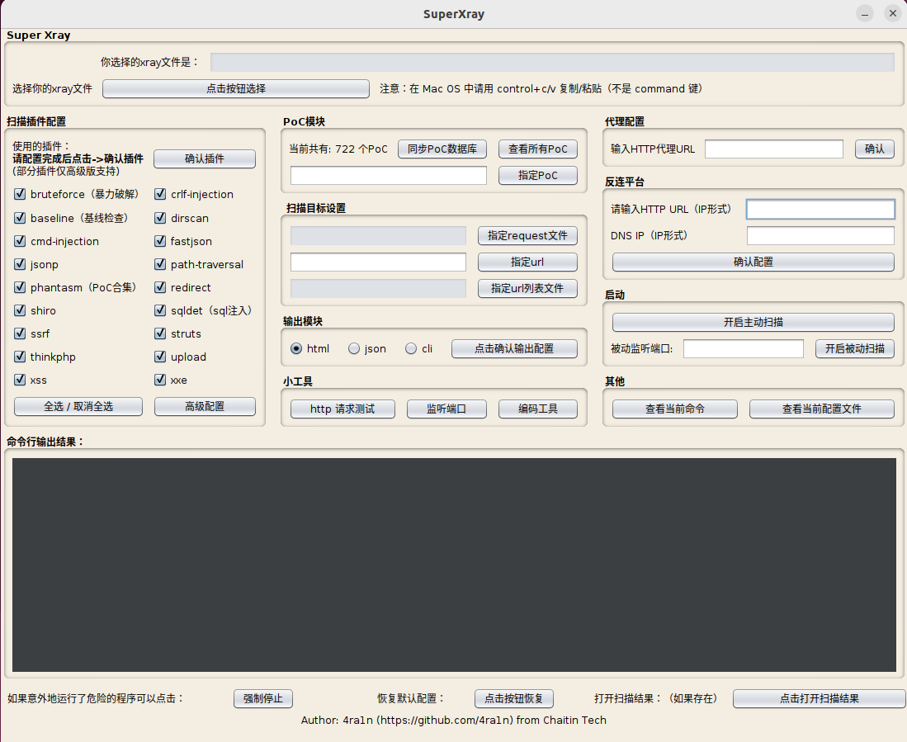

Load the xray binary file:

Note: There are security restrictions in Mac OS. Please set **System Preferences** -> **Security and Privacy** -> **General** -> **Still Open**

The command line output shows the following description: successful loading

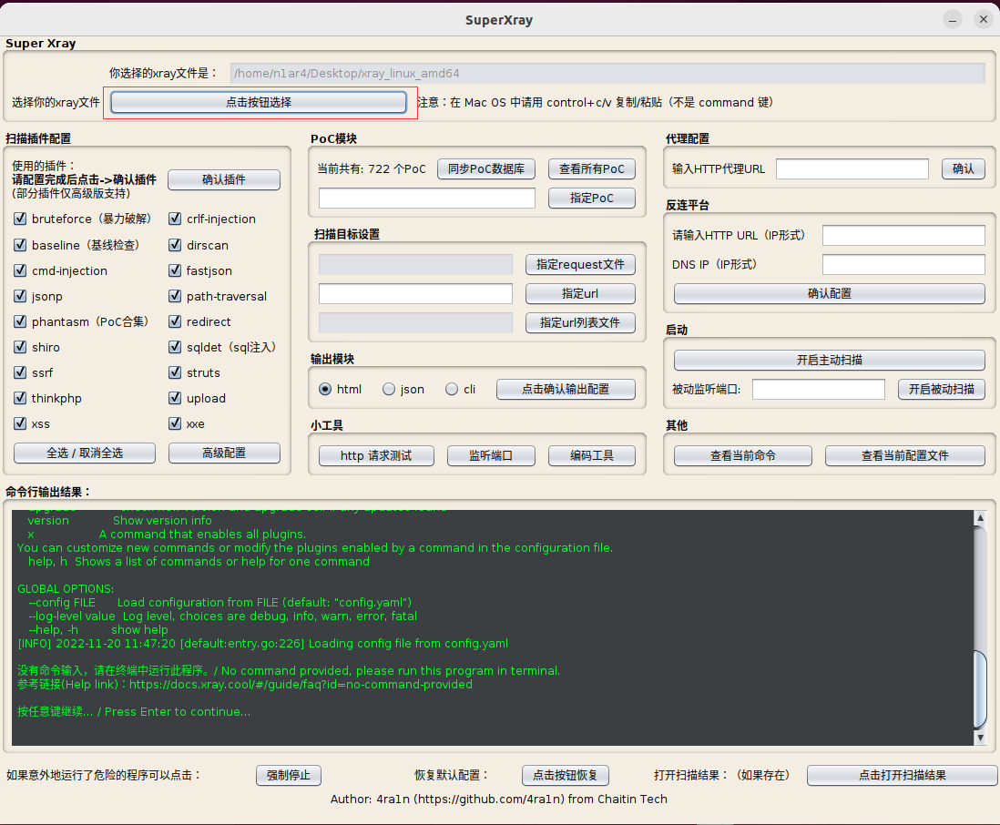

By default, all scanning plug-ins are enabled. After manual check, please select Confirm Plug in to make the new configuration effective

Prerequisites for clicking Enable Active Scanning:

- A plug-in is configured or a PoC is specified
- The scanning target must be set
- It is recommended to configure the output module. In general, it is recommended to use the html mode

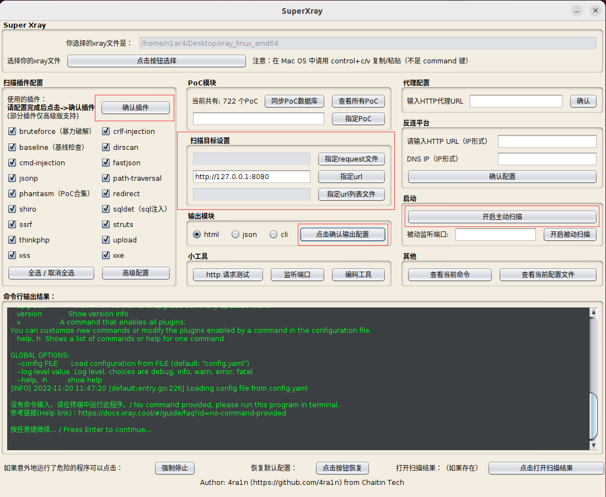

Check the results after scanning: click the button in the bottom right corner (it will be opened only if there are results)

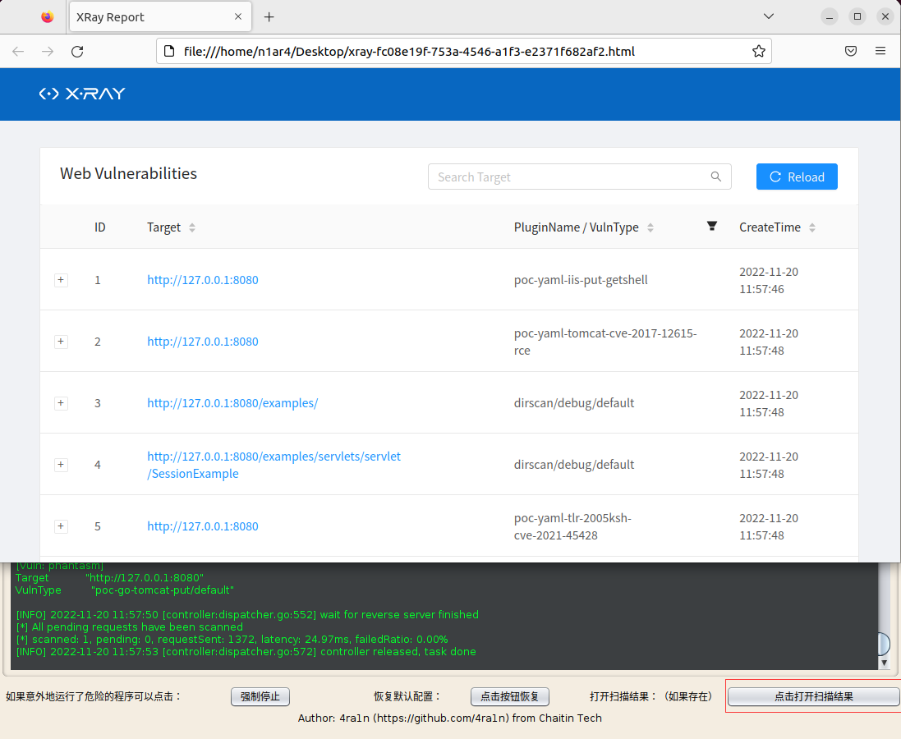

Others:

- Click the Restore button below to restore the default configuration
- Click below to force stop. Stop the current task immediately
- The reverse connection platform is an important function, but it needs more configuration. Please go to the official website to check the document
- 
## PoC Module

The PoC module is mainly used to query the supported PoC. After loading the xray binary file, it is recommended to click Synchronize PoC Database to update the latest list. Click the View All Poc button to open the search interface. After you find the desired PoC, you can fill it in the form below, and click Specify PoC to confirm the settings.

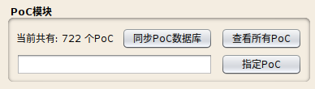

Lookup

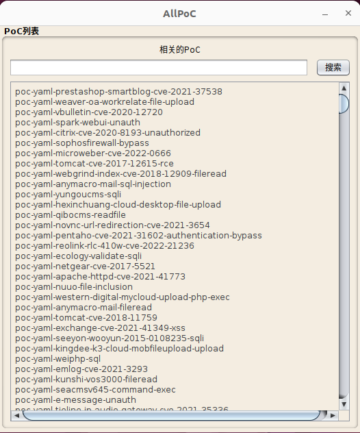

Search

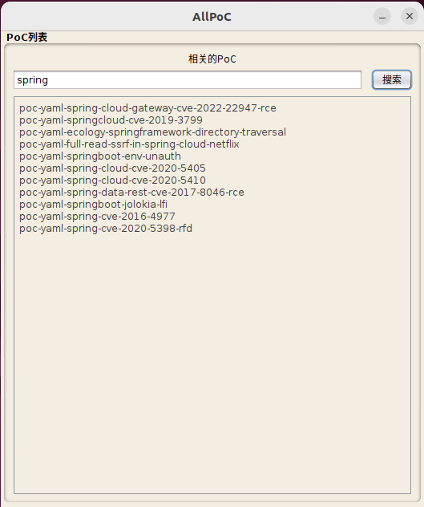

## Advance Config

Some plug-ins can be advanced configured:

- After completing each advanced configuration, please click Confirm Configuration to take effect
- The advanced configuration will take effect only when the corresponding plug-in is enabled in the main interface
- Some plug-ins are only supported by the advanced version of xray
- The logic of dictionary configuration is: merge with built-in dictionary

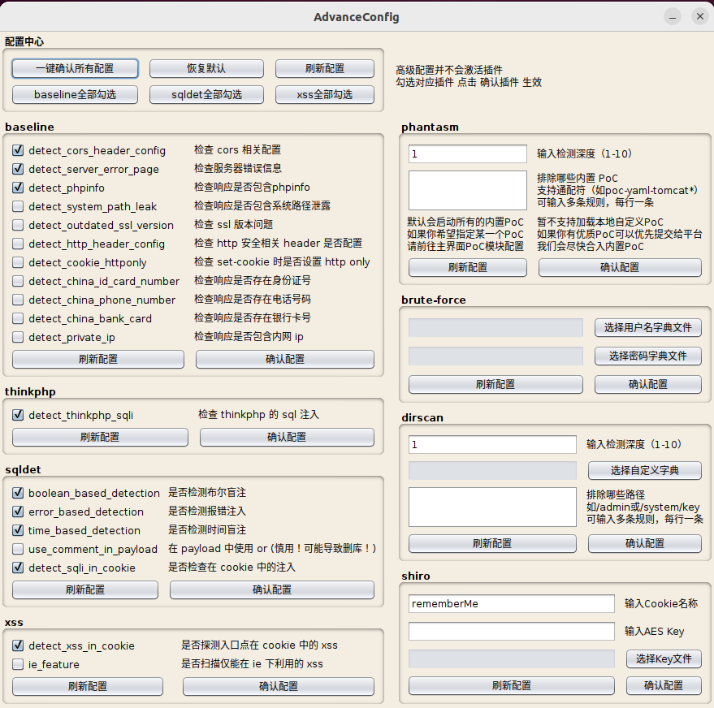

## Reverse

`xray`reverse platform supports both independent and integrated platforms. 
In most cases, it is deployed independently, so this project only considers this situation.

Independent deployment means:
- server open `reverse server` with `token` config
- client config `token` to connect server

After 0.8 version, we support:
- config server and export `config.yaml`
- user upload this config to server and start `xray`
- start scan with your `token` and `http ip`

## Tools

Like burp suite repeater

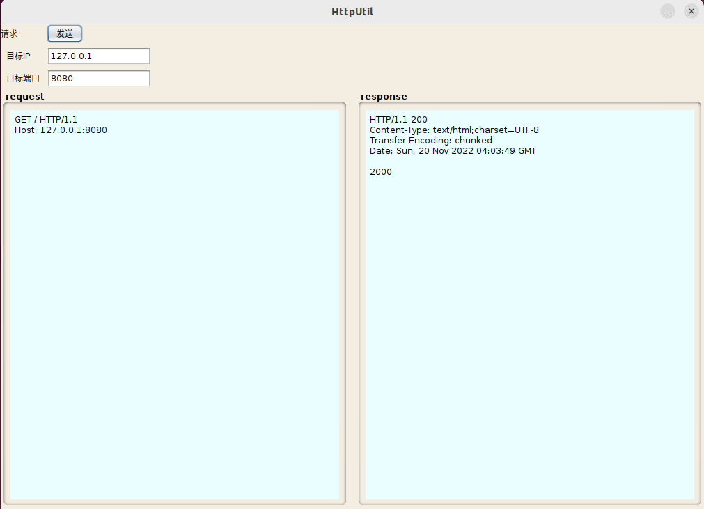

Like nc

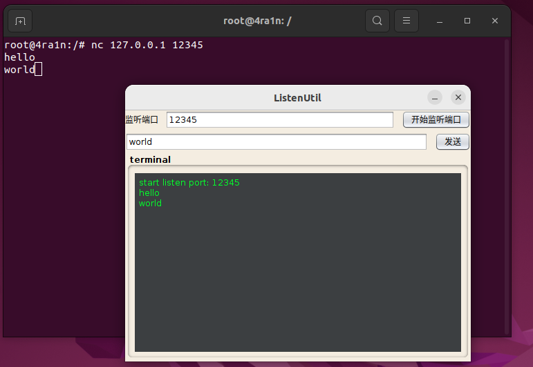

Like burp suite decoder

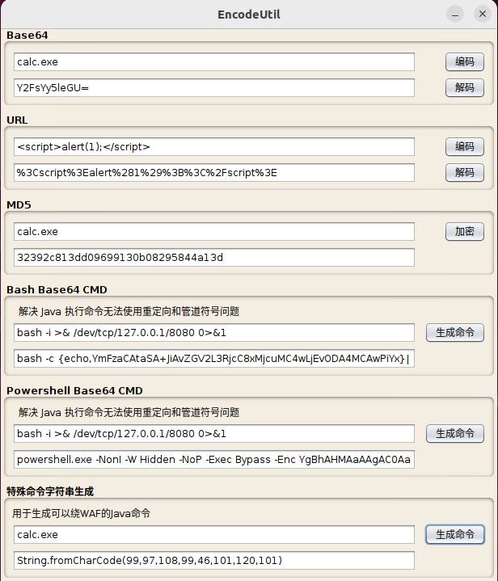

## Skin

Add some skin:
- IDEA `Flat`
- Java `Metal`,`Motif`,`Nimbus`
- Windows and classic
- Mac OS `Auqa`
- Gnome `Gtk`

## Security

Vulnerabilities of this project: https://github.com/4ra1n/super-xray/security/advisories

## Disclaimers

Unauthorized commercial use of this project is prohibited

Commercial use after secondary development is prohibited for this project

This project is only for legally authorized enterprise safety construction behavior. When using this project for testing, you should ensure that this behavior complies with local laws and regulations and has obtained sufficient authorization

If you have any illegal act in the process of using this project, you should bear the corresponding consequences, and we will not bear any legal and joint liability

Before using this item, you must carefully read and fully understand the contents of each clause. Restrictions, exceptions or other clauses involving your significant rights and interests may be highlighted in bold, underlined and other forms

Please do not use this project unless you have fully read, fully understood and accepted all the terms of this agreement

Your use behavior or your acceptance of this agreement in any other express or implied way shall be deemed that you have read and agreed to be bound by this agreement