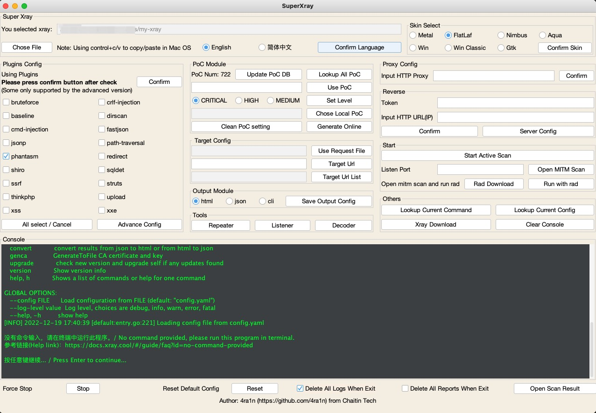
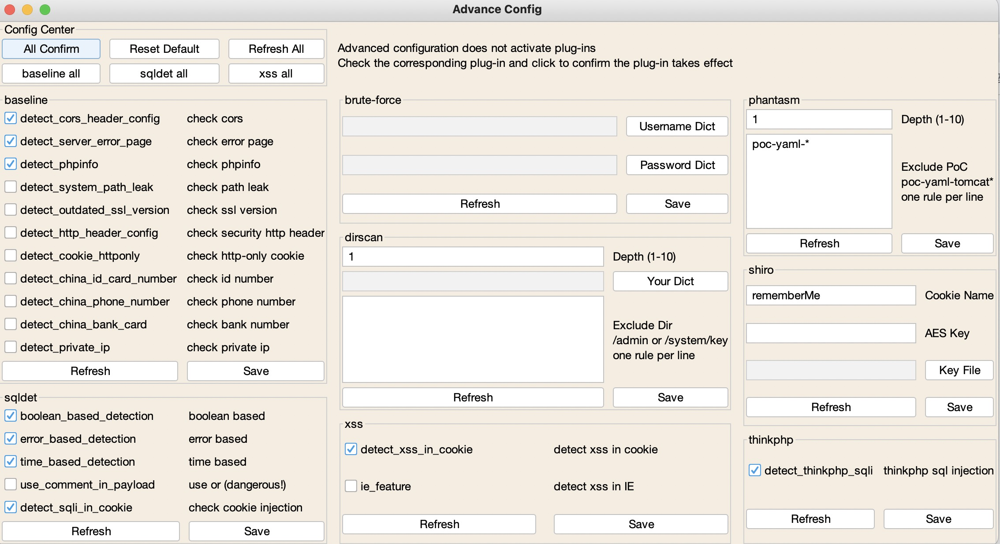

# Super Xray

## Introduce

[xray](https://github.com/chaitin/xray) is an excellent web vulnerability scanning tool, but only the command line version, start via `config.yaml` file. In many cases, it is difficult to get started, and a GUI tool is needed to help newcomers use it faster. This tool is just a simple command line wrapper, not a direct method call. In the planning of xray, there will be a truly perfect GUI version of XrayPro tool in the future. Please look forward to it.

Premise of use:
- There is a `JRE/JDK 8+` environment locally (if you use the `exe` version of the built-in `JRE`, you do not need a `Java` environment)
- Use `java jar SuperXray Jar` startup (double click startup in `Windows` will cause permission problems)
- Go to [ctstack](https://stack.chaitin.com/tool/detail?id=1) or [xray download](https://download.xray.cool) to download the latest `xray`

Note:
- Please use a resolution of 1080P or above, and it may not be fully displayed at a resolution of 720P or below
- Please use the latest version of `xray` (this tool is not compatible with the old version of `xray`)
- Two types of `exe` files are supported. The `system` version uses the systems `JRE` and the other has built-in `JRE 8`

Overall architecture:

Support english UI:

It is easy to search poc and run:

## Download

Latest Download：[Latest Release](https://github.com/4ra1n/super-xray/releases/latest)

## With rad

After version 0.8, it can be linked with `rad`:

Note: First enter the port to enable passive scanning, and then open the `rad` coordination

## Download Panel

After version 1.0, we support download panel:

## Subdomain Scan

After version 1.0, we support subdomain scan:

## Reverse

1. Click Configure Server
2. Enter any database file name
3. Enter the token password arbitrarily
4. Do not change the IP address and enter a listening port
5. Click Export Configuration File to get a reverse/config.yaml
6. Copy xray and this file to the server
7. Server `./xray reverse` Start the reverse platform
8. Enter the corresponding token and http url on the reverse connection platform (note that the IP format is http://1.1.1.1:8080 ）
9. Enable active scanning or passive scanning